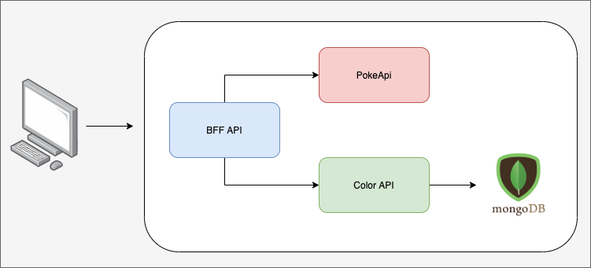

# Pokemon API
Abstração da [Pokemon API](https://pokeapi.co/api/v2/) para listagem dos pokemons informando se nome e as categorias (tipos) associados ao mesmo.

## Arquitetura
[](images/arquitetura.png)

## Instalação
Todo o projeto esta dockerizado. Para roda-lo basta rodar o comando 
```
docker-componse -f docker-compose.yml up
```

O **docker-compose.yml** contem os sequintes serviços:
- **mongo** - Banco da dados em MongoDB.
- **mongo-seed** - Script para a carga inicial do banco de dados.
- **colorapi** - API que retorna as categorias (tipos) dos pokemons e suas respecitivas cores.
- **bffapi** - API que abstrai a listagem de pokemons retornando seus nomes e tipos.

# BFF API
API que retornas os Pokemons cadastrados em [PokeAPI](https://pokeapi.co/api/v2/type) associando suas categorias (tipos) a cor correspondente na Color API.

- [Node](https://nodejs.org/en/)
- [Express](https://expressjs.com/pt-br/) - Web Framework.
- [Mongoose](https://mongoosejs.com/) - Biblioteca para interação com MongoDB.
- [joi](https://joi.dev/api/) - Biblioteca de validação de dados baseada em schemas.
- [dotenv](https://github.com/motdotla/dotenv#readme) - Biblioteca para utilização de variáveis de ambiente.
- [winston](https://github.com/winstonjs/winston#readme) - biblioteca de padrão para criação de log.
- [eslint](https://eslint.org/) - Biblioteca de lint
- [jest](https://jestjs.io/en/) - Framework para teste em Java Script.
- [supertest](https://github.com/visionmedia/supertest#readme) - Biblioteca para abstração para testes HTTP.
- [nock](https://github.com/nock/nock) - Biblioteca para mock de requisições HTTP.


## Instalação

Para instalar as dependencias basta acessar o terminal e rodar

```
yarn install
```
Na raiz do projeto existe o arquivo ``.env`` onde estão as configurações da url da PokeAPI, da url da ColorAPI e a porta onde a aplicação ira rodar. Coso não seja fornecdo uma porta o valor default é a **5000**.

```
PORT=5000
POKEAPI_URL=https://pokeapi.co/api/v2/
COLOR_API_URL=http://colorapi:8000
```

## Executando a API

O serviço possui os sequintes comandos para a execução:

```
yarn dev
```

```
yarn start
```

```
yarn test
```

```
yarn lint
```

- **start** - executa o serviço em produção.
- **dev** - executa em modo desenvolvimento reiniciando o serviço a cada alteração do código.
- **test** - executa as suites de teste da aplicação.
- **lint** - verfica o lint dos arquivos.

### Observação:
O serviço não executa se as variáveis de ambiente não estiverem configuradas corretamente. Como no exemplo:
``Error: Config validation error: "POKEAPI_URL" is required`` 

## Endpoints

### GET /
Lista os Pokémons e seus Tipos (categorias) com suas cores correspondentes. Por padrão a API retorna os 20 primeiros registros. Para alterar a quantidades necessário passar os parametros ``limt`` e ``offset`` por query string.
```
[
    {
        "name": "bulbasaur",
        "types": [
            {
                "name": "grass",
                "color": "#239B56"
            },
            {
                "name": "poison",
                "color": "#C39BD3"
            }
        ]
    },
    {
        "name": "charmander",
        "types": [
            {
                "name": "fire",
                "color": "#E74C3C"
            }
        ]
    }
]
```
#### Retorna os seguintes status:
- 200 - Categorias listadas com sucesso
- 500 - Erro ao tentar listar as categorias

### GET /?limit={limitValue}&offset={offsetValue}

```
[
    {
        "name": "bulbasaur",
        "types": [
            {
                "name": "grass",
                "color": "#239B56"
            },
            {
                "name": "poison",
                "color": "#C39BD3"
            }
        ]
    }
]
```

#### Retorna os seguintes status:
- 200 - Categorias listadas com sucesso
- 500 - Erro ao tentar listar as categorias


### GET /health

Retorna se aplicação esta running:

```
{
    status: 'ok'
}
```
#### Retorna os seguintes status:
- 200 - Retorna que o serviço esta running

# COLOR API

API que fornece as cores hexadecimais para cada uma das categorias (tipos) de Pokémons cadastrados em [PokeAPI](https://pokeapi.co/api/v2/type).

- [Node](https://nodejs.org/en/)
- [Express](https://expressjs.com/pt-br/) - Web Framework.
- [Mongoose](https://mongoosejs.com/) - Biblioteca para interação com MongoDB.
- [joi](https://joi.dev/api/) - Biblioteca de validação de dados baseada em schemas.
- [dotenv](https://github.com/motdotla/dotenv#readme) - Biblioteca para utilização de variáveis de ambiente.
- [winston](https://github.com/winstonjs/winston#readme) - biblioteca de padrão para criação de log.
- [eslint](https://eslint.org/) - Biblioteca de lint.
- [jest](https://jestjs.io/en/) - Framework para teste em Java Script.
- [supertest](https://github.com/visionmedia/supertest#readme) - Biblioteca para abstração para testes HTTP.
- [mongodb-memory-server](https://github.com/nodkz/mongodb-memory-server) - Biblioteca para mock MongoDB, criando um banco em memoria. Utilizada durante os testes.


## Instalação

Para instalar as dependencias basta acessar o terminal e rodar

```
yarn install
```
Na raiz do projeto existe o arquivo ``.env`` onde estão as configurações da url do banco de dados e a porta onde a aplicação ira rodar. Coso não seja fornecdo uma porta o valor default é a **8000**.

```
PORT=8000
DATABASE_URL=mongodb://localhost:27017/colors
```

## Executando a API

O serviço possui os sequintes comandos para a execução:

```
yarn dev
```

```
yarn start
```

```
yarn test
```

```
yarn lint
```

- **start** - executa o serviço em produção.
- **dev** - executa em modo desenvolvimento reiniciando o serviço a cada alteração do código.
- **test** - executa as suites de teste da aplicação.
- **lint** - verfica o lint dos .

### Observação:
O serviço não executa se as variáveis de ambiente não estiverem configuradas corretamente. Como no exemplo:
``Error: Config validation error: "DATABASE_URL" is required`` 

## Endpoints

### GET /colors
Lista todas as categorias cadastradas e suas respectivas cores.
```
[
    {
        "_id": "5fe8a68b0a0f333989d727d3",
        "category": "normal",
        "color": "#3498DB"
    },
    {
        "_id": "5fe8a6980a0f333989d727d4",
        "category": "fighting",
        "color": "#ECF0F1"
    },
    {
        "_id": "5fe8a6a40a0f333989d727d5",
        "category": "flying",
        "color": "#2E86C1"
    },
    {
        "_id": "5fe8a6b00a0f333989d727d6",
        "category": "poison",
        "color": "#C39BD3"
    }
]

```
#### Retorna os seguintes status:
- 200 - Categorias listadas com sucesso
- 500 - Erro ao tentar listar as categorias


### GET /colors?category={categoryValue}
Retorna os dados de uma categoria especifica. Exemplo ``http://localhost:8000/colors?category=fighting``

```
[
    {
        "_id": "5fe8a6980a0f333989d727d4",
        "category": "fighting",
        "color": "#ECF0F1"
    }
]
```

#### Retorna os seguintes status:
- 200 - Categoria listada com sucesso
- 404 - Nenhuma categoria encontrada para este filtro
- 500 - Erro ao exibir os dados da categoria


### POST /colors

Recebe o seguinte payload no body:
```
{
    "category": "poison",
    "color": "#C39BD3"
}
```
Retorna o seguinte payload:

```
{
    "_id": "5fe8a6b00a0f333989d727d6",
    "category": "poison",
    "color": "#C39BD3",
    "__v": 0
}
```

#### Retorna os seguintes status:
- 201 - Categoria cadastrada com sucesso
- 500 - Erro ao cadastrar uma categoria

### DELETE /colors/{categoriaID}

Retorna o seguinte payload:

```
{
    "message": "Category successfully deleted"
}
```
#### Retorna os seguintes status:
- 200 - Categoria excluida com sucesso
- 404 - Categoria não encontrada
- 500 - Erro ao excluir uma categoria


### GET /health

Retorna se aplicação esta running:

```
{
    status: 'ok'
}
```
#### Retorna os seguintes status:
- 200 - Retorna que o serviço esta running


